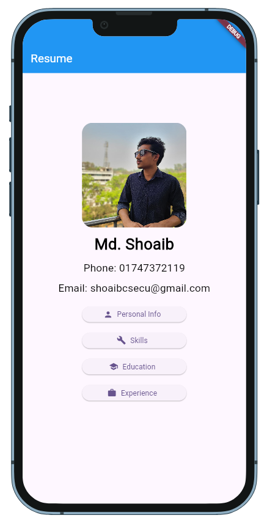
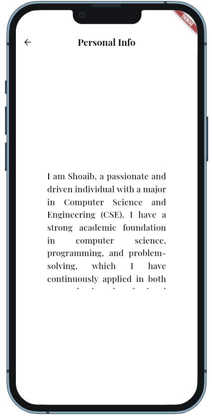
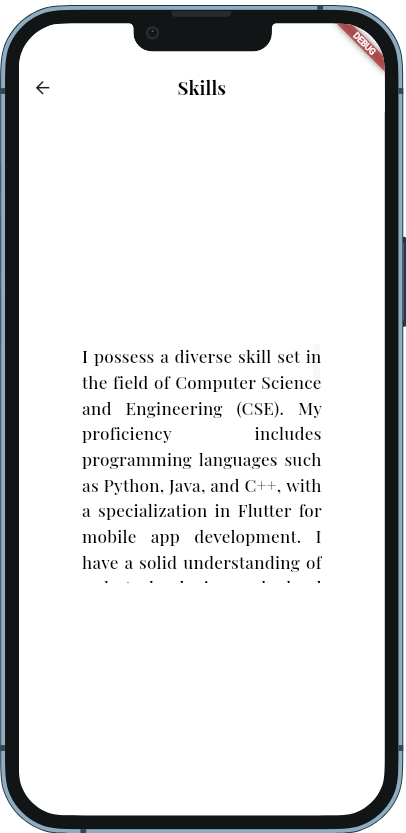

# Resume App

A professional Resume Builder app built using Flutter.

## 📱 Features
- Display Personal Information
- Showcase Skills, Education, and Experience
- Smooth navigation with GetX
- Hover Effect for Button Interactivity
- Responsive and Clean UI

## 🛠️ Technologies Used
- Flutter
- Dart
- GetX (State Management & Navigation)
- Google Fonts

## 📸 Screenshots

| Home Page                       | Personal Info                            | Skills                            |
|---------------------------------|------------------------------------------|-----------------------------------|
|  |  |  |


## 👉 Live Demo


## 🚀 Getting Started

### Prerequisites
- Install [Flutter](https://flutter.dev/docs/get-started/install)
- Install Dart SDK
- Set up a suitable IDE (VS Code, Android Studio, etc.)


## 📂 Project Structure
```
/lib
├── main.dart           # Entry point
├── home_page.dart      # Home Page
├── personal_info.dart # Personal Information Section
├── skills.dart        # Skills Section
├── education.dart     # Education Section
├── experience.dart    # Experience Section
├── assets/images/     # Images used in UI
└── pubspec.yaml        # Dependencies and assets
```

## 🔥 How It Works
1. Display your profile picture and personal information.
2. Hover on buttons like "Skills," "Education," and "Experience" to show details in a box.
3. Smooth navigation between different sections using GetX.


## 👤 Author

**Md. Shoaib**  
📧 Email: shoaibcsecu@gmail.com  
🔗 GitHub: [Md. Shoaib](https://github.com/S-h-o-a-i-b)

